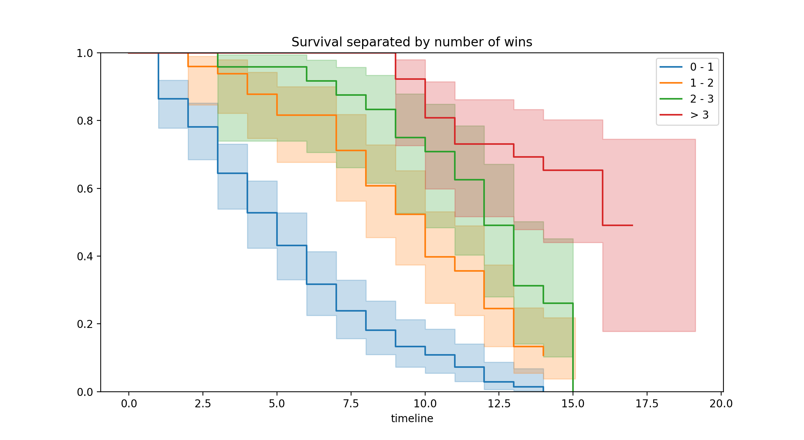
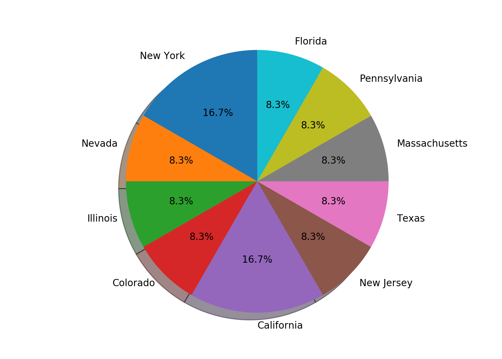

<h1 align="center" style="font-weight: normal;">Top Chef Survival Analysis</h1>

<div align="center">
  <a href="https://docs.python.org/3/">
    
  </a>
  
  <a href="https://docs.scipy.org/doc/numpy/reference/index.html">
    
  </a>
  
  <a href="https://pandas.pydata.org/pandas-docs/stable/">
    
  </a>
  
  <a href="https://lifelines.readthedocs.io/en/latest/">
    
  </a>
</div>

<br>

## Methods:
Each episode of Top Chef generally follows the same basic format:
	
  •	Quickfire Challenge – Chefs must cook a dish meeting certain requirements or complete a culinary challenge, usually in under an hour or less. The winner or winners of this challenge usually receives some sort of advantage in the Elimination Challenge.
	
  •	Elimination Challenge – The contestants must complete a larger culinary challenge, spanning from a few hours to several days. After the Elimination Challenge, the contestants are judged – one or more of the chefs are named the winner, and one of the contestants is eliminated. 


I used a Cox’s proportional hazard model from the python library [Lifelines](https://lifelines.readthedocs.io/en/latest/). The risk outputted by the model represents the risk of a contestant being eliminated. Variables that are taken into account:

### Time-invariant covariates: 

1.	Age – The age of the contestants range from 21 to 59. There are three contestants whose age were not on Wikipedia (Justin Devillier, Sara Johannes, Michael Sichel from Season 11). Their ages were replaced with the average age of contestants.

### Time-variant covariates:
These variables change as the season goes on. They are indicators of each contestants’ performance.

1.	Wins – Sometimes there are group challenges, in which case we have to consider how to “tally” those. One option is for every person on the winning team to get one win each. Another option is to “share” the win - i.e. if there were four people on the winning team, they each get 1/4 of a win each. This is controlled by the sharedWins input variable.
  
2.	Quickfire Wins – Most episodes begin with a Quickfire Challenge. The winner(s) of this challenge sometimes get an advantage in the elimination challenge. Multiple people can win the Quickfire challenge, so the same issue of “sharing” applies here as it does with elimination wins.

3.	Highs and lows – The contestants that are the top entries in the Elimination Challenge but did not win are “high.” The bottom entries who were not eliminated are “low.” 

I compiled the data from the Wikipedia charts for each season of the show* and put them into csv files. The data_processing.py file contains all the functions to read in and process this data into the format we want. There’s a row for each contestant and each episode.

When you run data_analysis.py, you should see some output such as survival curves separated by age and number of wins, as well as the relative risk of contestants at season 13, episode 10. 

*I compiled season 1-7, 9-13. I did not include season 8 because it was an “All-Stars” season where previous contestants were brought back to compete.

## Figures:







## Getting Started:
- Clone this repo
- Install dependencies: ```pip install```
- In the main directory, run: ```python ./data_analysis.py```

## Dependencies:
- [Pandas](https://pandas.pydata.org/)
- [NumPy](https://www.numpy.org/)
- [Lifelines](https://lifelines.readthedocs.io/en/latest/)

### References:
[Lipsyncing for your life: a survival analysis of RuPaul’s Drag Race](http://badhessian.org/2013/03/lipsyncing-for-your-life-a-survival-analysis-of-rupauls-drag-race/)
